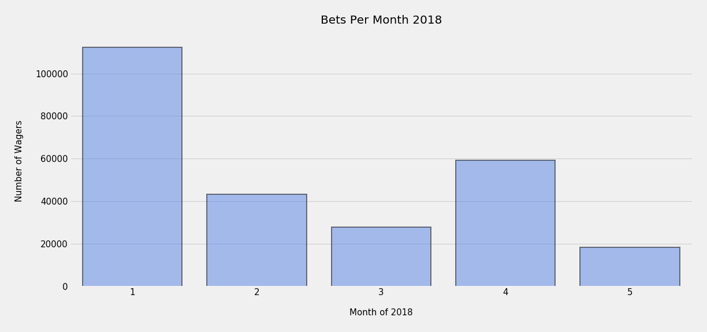
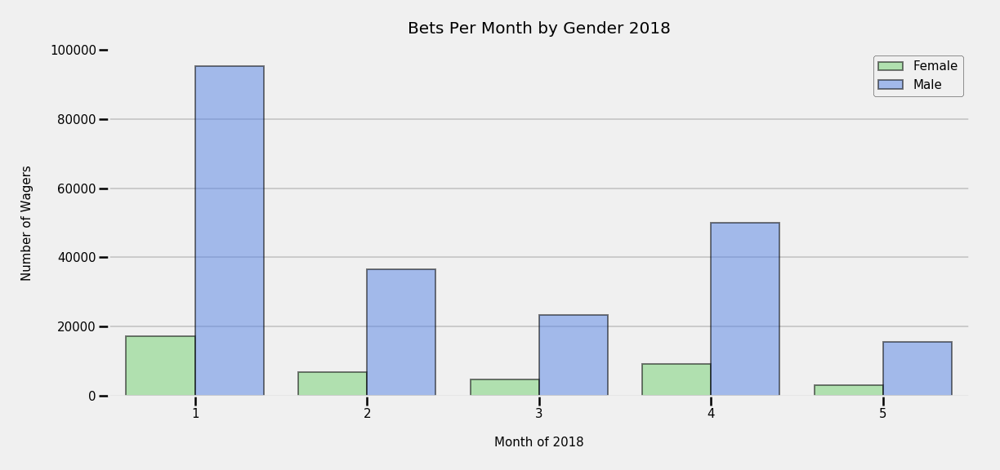
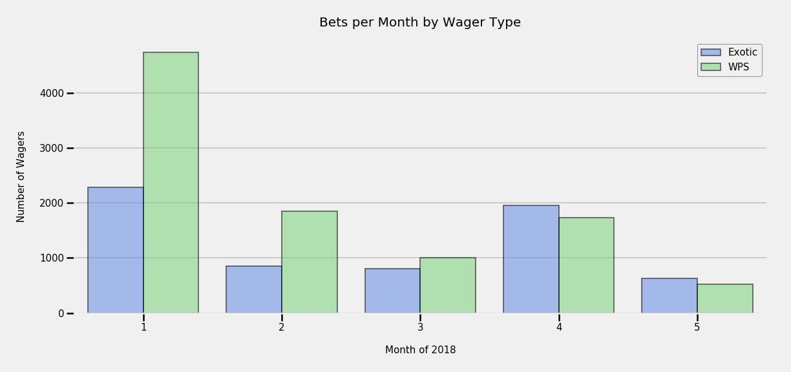
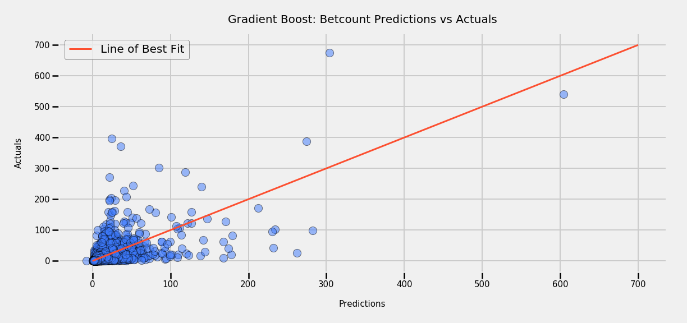

<h1 align="center">Horse Wager Marketing Evaluation</h1>

*Jon Nelson*

---

## Outline

- [Description](#description)
- [File Structure](#file-structure)
- [Data Dictionary](#data-dictionary)
- [Exploratory Data Analysis](#exploratory-data-analysis)
- [Production Modeling](#production-modeling)
- [Conclusions](#Conclusions)

## Description

During the 2018 horse racing season a sample of data was collected between the months of January and May which included the device the wager was made from, the type of wager made, the amount of the wager, the total amount earned by the operator through the wager and the number of total bets that were made as part of each individual wager. Along with this data is the customer demographics for the individual who made the wager which includes the state where this individual made the wager, the gender of the individual making the wager and the age of the individual making the wager.

In the month of April a 35,000 dollar marketing campaign was launched to attempt to increase the number of bets being made for each wager. Using this information and the two datasets I will analyze the success of the marketing campaign and identify additional areas for the marketing team to target in order to increase the number of bets being made as part of each wager moving forward.

---

## File Structure

- <a href="data">data</a>
- <a href="code">code</a>
- <a href="pickles">pickles</a>
- <a href="plots">plots</a>
- [README.md](./README.md)

---

## Data Dictionary

### Betting Activity

- `UserID`    : a customer identifier
- `Bet Month` : the month in which a bet was placed
- `Platform`  : whether the bet was placed through mobile or desktop platform
- `Handle`    : the amount bet
- `Revenue`   : the part of the amount originally wagered that composes the operator’s profit
- `Bet Type`  : category (Exotic or WPS, i.e. win place show)
- `Betcount`  : number of bets placed

### Customer Demographic Data

- `UserId` : a customer identifier
- `State`  : the state the customer is from
- `Gender` :  the gender of the customer
- `Age`    : the age of the customer

---

## Exploratory Data Analysis

### Total Bets per Wager

The below plot reviews the total number of bets made within each wager across each month of data provided. This will provide a high level understanding on if there is any increase in the number bets in April when the marketing campaign launched.

##### Interpretation

The most number of bets were made in the initial month of January and is decreasing in each proceeding month until April. We can see an increase in the number of bets made with each wager in April which tells us that something did change during this month and if we assume that all other factors were held equal we can assume that the marketing campaign is the reason for the increase in bets.

  

### Wagers by Gender

After confirming, through assumptions, that the marketing campaign launched in April did increase the number of bets made with each wager I now want to review the wagers by gender to understand if there is a specific gender that contributed the most to the bet counts.

##### Interpretation

Immediately apparent is that males are making more wagers than females. It's also evident that in April something changed to increase betting activity in both females and males. Again, if we assume that all factors were held equal moving into this month then it can be assumed that the marketing campaign contributed to the increase in total bets.

  

### Age Distributions

So, I've confirmed that there was an increase in bets in April and specifically these bets were made by the male gender and now I want to understand the ages for these individuals in order to see what ages are contributing the most to the betcount.

##### Interpretation

From the distribution below there is a pretty wide range of individuals making bets between the ages of 18 and 69 but the bulk of the bets are being made from individuals between the age of 18 and 40.

Interesting findings between the male and female age distributions is that the peaks for males contributing the most bets are between 18 and 25 while the peaks for females contributing the most bets are between 25 and 35. Another interesting finding was that females around the age of 40 contributed almost nothing to the betcount in the first five months of the 2018 horse racing season.

#### Age Distributions for 2018 season

  

#### Age Distributions by Gender for 2018 season

  

### Wagers by State

Let's now look at which states have the most individuals contributing to the bet count being made during the first five months of the 2018 horse racing season.

##### Interpretation

What is immediately apparent is that the southern states of Kentucky and Florida have the highest contribution to the bet counts with California a close third. Also, April again saw a jump in bet counts after the previous two months saw decreases in all states with the largest increase coming from Kentucky.

  

### Wagers by Device

Let's next review how these individuals are making bets specifically if they are using a computer or a mobile device.

##### Interpretation

Two options were tracked when identifying how these individuals were making bets, Desktop or Mobile. After analyzing this data, from month to month, it's certainly clear that the mobile option is the preferred choice for making bets and it's also clear again that April still sees an increase in total bets from the previous two months.

  

### Wager Type per Month

Next, I will review the types of bets that are being made to determine the types of bets that are most popular and contributing the most to the bet counts.

##### Interpretation

The Win Place Show (WPS) bets were the bets being placed the most in the first three months of 2018 but moving into April we see a large increase in Exotic bets which actually ended up having more bets than the WPS. I think what we can infer from this is that the marketing campaign launched in April affected individuals betting habits towards Exotic bets and there is also evidence to back this up by looking at the month of May as we can also see that the Exotic bet count surpassed the WPS bet total.

  

---

## Production Modeling

Using machine learning techniques I will build a model to predict the total number of bets per wager. This will allow me to examine what features within the dataset are providing the most influence in the bet counts that we've seen in the first five months of the 2018 horse racing season. The features that are identified through this model will be my recommendations to the marketing team as the primary areas to target in future marketing campaigns.

---

The highest scoring model that I was able to create was with the GradientBoostRegressor and will be my recommendation as the production model for making predictions on the total number of bets being made per each wager.

I explored five different models during the modeling process with the following scores.

| Model                  | Train Score | Test Score |
|------------------------|-------------|------------|
| GradientBoostRegressor |    0.7851   |   0.3825   |
| RandomForestRegressor  |    0.9017   |   0.3189   |
| SupportVectorRegressor |    0.1185   |   0.1019   |
| AdaBoostRegressor      |   -0.0232   |   0.0090   |
| ElasticNet             |    0.0      |  -0.0001   |

### GradientBoostRegressor

When boosting a model the model is building multiple simple models and learning from these models to be more approximate when predicting. These simple models are referred to as weak models or weak learners.

Gradient Boosting looks at these weak models sequentially and trains on the residuals or errors in order to give more importance to the less accurate predictions and once completed uses what was learned from these predictions to combine with the strong predictions to have a better overall approximation.

#### GradientBoostRegressor Metrics

| Metric    | Baseline  | GradientBoostRegressor |
|-----------|-----------|------------------------|
|  R2 Score |    0.0    |        0.3825          |
|  Average  |    7.6410 |        7.8165          |
|  RMSE     |   19.79   |       15.55            |

##### Final Interpretation of Production Model

The Production Model I am choosing is the Gradient Boost Regressor. This model outperformed the baseline metrics in all three categories:
- Average: The goal was to obtain a value close to the average of true target variable in the test data:
    - Baseline Average: 7.6410
    - Model Predictions Average: 7.8165
- R2: The goal was to obtain a larger value (or percentage of explained variance) than the baseline but not go over one
    - Baseline R2: 0
    - Model R2: 0.3825
- RMSE: The goal was to obtain a smaller value than the baseline
    - Baseline RMSE: 19.79
    - Model RMSE: 15.55

#### Production Model Predictions vs Actuals

Plotting the predictions from the Gradient Boost model against the actual values (total bets per wager) will show visibly how the model performed.

##### Interpretation

The plot is showing that my model is a bit overfit with a lot of the predictions showing below the line of best fit. However, when the total number of bets made on a wager are below 100 my model is predicting quite well and it's not until there are wagers with a total number of bets above 100 when we start to see the most variations in the predictions.

  

#### Feature Importances

Finally, we can review the features that were most influential in helping the model make predictions.

##### Interpretation

The top two features were expected because the handle (amount of the wager) and revenue (amount earned by the operator from the wager) will be determined by the number of bets placed at that moment. The third top feature is interesting, the age of the individual who places the bet had a very strong influence on the total number of bets made as part of each wager. The rest of the features are very close in weight all being below 0.05 but it's worth noting that the next top four features are the months where the most bets were placed followed by the states of the individuals where the most bets were made.

  

---

## Conclusions

### Review of the 2018 Horse Racing Season

After a thorough review of the first five months of the 2018 horse racing season it's clear that through the first three months of the year the most bets were being made but with decreasing bet counts occuring one month after the other. An increase in bets wasn't seen again until the fourth month (April) and the most notable difference in this month was that it was the first month to see more exotic bet types made than win place show (WPS) bets. The gender contributing the most to the total number of bets is Males between the ages of 18 to 25 and although Females are not contributing as much they stil have an impact with the bulk of their bets coming from the ages between 25 and 35. From a geographic perspective the southern states of Kentucky and Florida are the top two states with individuals contributing to the total number of bets, with California a close third, and the method of choice for these individuals to make bets is  primarily from a mobile device.  

### April Marketing Campaign

The marketing campaign launched in April definitely helped increase the total number of bets being made as part of each wager as we saw an increase in total bets from the previous two months. I also looked at the operator profit after spending the 35,000 dollars to launch the campaign and the net take for the month of April was 52,746.53 dollars which was more than the previous month but still lower than month two. Overall, the marketing campaign definitely helped in increased bets and saw a revenue increase from the previous month along with a specific increase in Exotic wager types.

  

### Future Marketing Recommendations

Through the modeling process I found that specific areas were more influential in determining the total number of bets being made with each wager in the 2018 horse racing season and I would recommend that the Marketing Team consider these areas prior to launching their next campaign.

**Most Influential Features:**
- Age of the individuals placing wagers
- Month of the horse race
- State in which the individuals are placing wagers

From the data I've analyzed the campaign should target the age of the individuals making bets along with displaying the successes of these individuals from previous months in the states where horse racing is most popular specifically where we are seeing the individuals contributing the most to the total number of bets being placed.
